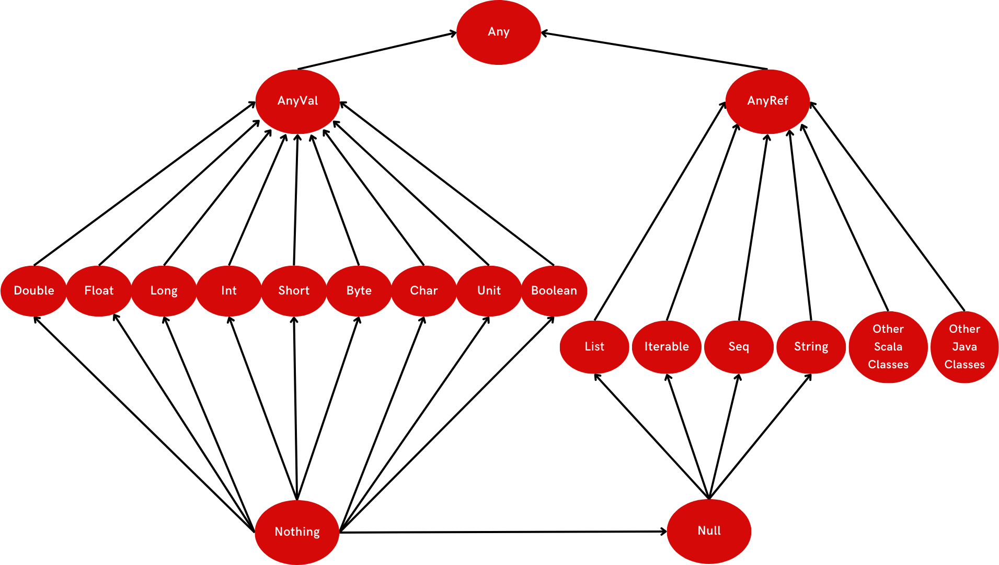
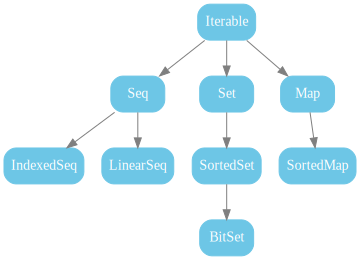
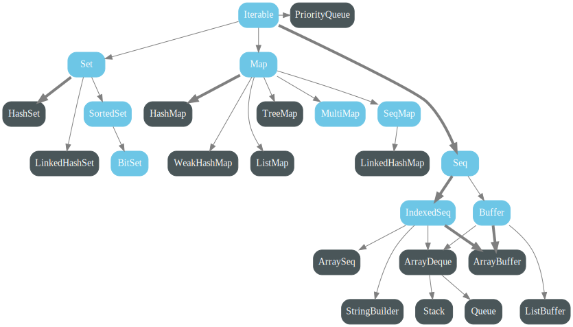
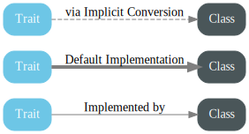

<h1 style="text-align:center;">  THE SCALA PROGRAMMING LANGUAGE</h1>

<h3 style="text-align:center;">Basics of Scala Programming Language</h3>

<p>Welcome to the world of Scala! This tutorial will guide you through the fundamentals of Scala programming, exploring its versatile features that combine object-oriented and functional paradigms. Whether you're a seasoned developer or a programming novice, Scala has something unique to offer. Let's embark on this journey into the basics of Scala programming.</p>

## Table of Contents:

- [A Scalable Language](#a-scalable-language)
- [Variables in Scala](#variables-in-scala)
- [Strings](#strings)
- [Operating with Operators](#operating-with-operators)
- [Collections](#collections)
- [Control Structures](#control-structures)
- [Functions](#functions)
- [Classes and Objects](#classes-and-objects)
- [What's Next?](#whats-next)
- [Sources](#sources)

## A Scalable Language

  ### What is Scala?
   "Scala is a general-purpose programming language providing support for both object-oriented programming and functional programming, and a strong static type system. Designed to be concise, many of Scala's design decisions aimed to address criticisms of Java."  [Source](https://en.wikipedia.org/wiki/Scala_(programming_language))
  
  ### Why use Scala?
   The first answer to "Why use Scala?" is in its name: Scala stands for **SCA**lable **LA**nguage. It is designed to grow with the demands of its users, from writing small scripts to building massive systems for data processing, distributed computing, and more.

   - _Scalability_: As the name suggests, Scala is scalable. It can seamlessly adapt to the evolving needs of your project, whether you're writing a quick script or developing complex, data-intensive applications.

   - _Combination_ of Paradigms: Scala supports both object-oriented and functional programming, offering the best of both worlds. This flexibility allows developers to choose the approach that best suits their problem.

   - _Static Typing_: Scala has a strong static type system, catching errors at compile-time rather than runtime, providing robustness to your code.

  ### Who uses Scala?
   The most common job titles you'll see are variants of software engineer, and data engineer. You'll also see data scientist and ML engineer more frequently as companies in all industries realize the challenges of analyzing big data. These companies are adopting Scala alongside data processing tools like Apache Spark.

## Variables in Scala
  "Variables are nothing but reserved memory locations to store values. This means that when you create a variable, you reserve some space in memory." [Source](https://www.tutorialspoint.com/scala/scala_variables.htm)

  ### Declaring a Variable

   In Scala, variables are used to store and manipulate data. There are two main types of variables: __`val`__ and __`var`__.
     
   The general format for daclaring a variable in scala is:

  ```Scala
    keyword variableName: DataType = Initial Value
   ```

   Where the `keyword` is one of the following:
   
   - `val` _(value)_: value cannot be changed after initialization, it's __immutable__
      
  ```scala
    // Example for val
    val x: Int = 10
  ```

   - `var` _(variable)_: value can be changed after initialization, it's __mutable__
      
  ```scala
    // Example for var
    var y: String = "Hello"
  ```

  ### Data Types

   In Scala, every value has a type and each type is part of a type hierarchy. In a type hierarchy, the more generic types are at the top and as you go lower in the hierarchy, the types get more specific. Each type has a requirement of its own along with the requirements of all the types above it in the hierarchy.

   ```
    Any
    ├── AnyVal
    │  ├── Int
    │  ├── Long
    │  ├── Double
    │  ├── Float
    │  ├── Long
    │  ├── Char
    │  ├── Boolean
    │  ├── Byte
    │  └── Unit
    ├── AnyRef (or Object)
    │  ├── String
    │  ├── List
    │  ├── Set
    │  ├── Map
    │  ├── Function
    │  ├── Tuple
    │  ├── Option
    │  ├── Iterable
    │  └── ...
    ├── Null
    └── Nothing
  ```

  

   NB: 

   - `Unit` is a subtype of _scala.AnyVal_. There is only one value of type `Unit`, `()`, and it is not represented by any object in the underlying runtime system. A method with return type Unit is analogous to a Java method which is declared void. ([Source](https://github.com/scala/scala/blob/v2.12.5/src/library/scala/Unit.scala#L1))
   - `Null` is a subtype of all reference types (including _scala.AnyRef_).
   - `Nothing` is a subtype of all types, both reference and value types.

  ### Type Inference

   Scala has a powerful type inference system, allowing you to omit explicit type declarations when the compiler can infer the type:

   - Scala compiler automatically determines the data type of the expression and assigns to the variable based on its value. It is called as *__type*
   - If you don’t specify the data type of a variable explicitly then Scala will infer its type from the initial value assigned to that variable.
   
   ```scala
    keyword variableName: DataType = Initial Value
                        ||
    keyword variableName = Initial Value
   ```

   Example:
   ```scala
    // Explicit type declaration
    val x: Int = 10

    // Type inference - Compiler infers the type based on the initial value
    val xInferred = 10
   ```

   Type inference enhances code readability and reduces the need for explicit type annotations.

  ### Type Casting

  Type casting, also known as type conversion, is the process of converting a value from one data type to another. In Scala, type casting can be explicit or implicit, depending on the scenario.

  #### Type Casting Flow:

  In Scala, the type casting flow follows a hierarchy, and explicit casting is needed when moving from a less specific type to a more specific one:

  ```
  Byte —> Short —> Int —> Long —> Float —> Double
                    ^
                    | 
                   Char
  ```

  #### Explicit Type Casting:

  To explicitly cast a value from one type to another, you use the `to*` methods provided by each numeric type:

  ```scala
  val intValue: Int = 42
  val doubleValue: Double = intValue.toDouble // Explicitly casting Int to Double
  ```

  In the example above, the `toDouble` method is used to explicitly cast an `Int` to a `Double`.

  #### Implicit Type Conversion:

  Scala also supports implicit type conversion in certain cases, such as when assigning a value to a variable of a different type:

  ```scala
  val intNumber: Int = 42
  val doubleNumber: Double = intNumber // Implicit conversion from Int to Double
  ```

  In this case, Scala automatically converts the `Int` value to a `Double`.

  #### Avoiding Type Casting Pitfalls:

  While type casting is a powerful tool, it's important to be cautious to avoid runtime errors. Always ensure that the conversion makes sense in the context of the program, and consider potential loss of information when narrowing types.

  ```scala
  val doubleValue: Double = 42.5
  val intValue: Int = doubleValue.toInt // Be aware of potential loss of decimal precision
  ```

## Strings
  ### Declaring a String:

   - Explicitly mentioning the data type:
  
   ```scala
   val myFirstString: String = "I'm a string"
   ```

   - Using type inference:
   
   ```scala
   val mySecondString = "Type Inference is Cool!"
   ```

  ### Using Java’s String Methods:
   
   - Length of a String:

   ```scala
   val stringVar = "What is the length of this string?" 
   println(stringVar.length())
   ```

   - String Concatenation:

   ```scala
   println("Hello " + "Data")   
   println("This is the integer " + 5)

   val string1 = "Hello" 
   val string2 = "Data"
   println(string1.+(string2))

   val aFloat = 1.5F
   println("This is the floating point " + aFloat)
   ```

  ### String Interpolation:

   - The __s__ String Interpolator: Prepending s to any string literal allows the usage of variables directly in the string.
   
     - Formats:
     ```scala
     s"Optional String $VariableIdentifier Optional String" 
     
     s"Optional String ${Expression} Optional String"
     ```

     - Example:
     ```scala
     val name = "James"
     val bDay = 2001
     println(s"$name is ${2024-bDay} years old")  // "James is 23 years old"
     ```

   - The __f__ String Interpolator: Prepending `f` to any string literal allows the creation of simple formatted strings, similar to `printf` in other languages. When using the `f` interpolator, all variable references should be followed by a `printf`-style format string, like `%d`
   
     -  Formats:
     ```scala
     f"String $VariableIdentifier%FormatSpecifier String"
   
     %FormatSpecifier == %FlagWidth.PrecisionConversion-Character
     ```

       - Flag:

       |Flag|Use|
       |---|---|
       |-|left justify|
       |+|add a + sign|
       |0|add padded zeros|
       |,|separator|
    
       - Conversion-Characters:

       |Character|Use|
       |---|---|
       |s|Strings|
       |d|decimal integers|
       |f|floating-point numbers|
       |t|date/time values|

     - Example:
     ```scala
     val pi = 13.14159F
     print(f"The value of pi is $pi%1.2f") // The value of pi is 3.14

     val testWidth = 123
     println(f"Without specifying the width, we get $testWidth")  // Without specifying the width, we get 123
     println(f"With specifying the width, we get $testWidth%-10d") // With specifying the width, we get        123
     ```

   - The __row__ String Interpolator: The raw interpolator is similar to the `s` interpolator except that it performs no escaping of literals within the string
   
     - Format:
     ```scala
     row"Optianal String EscSeq Optional String"
     ```

     - Escape Sequence:

     |EscSeq|Use|
     |---|---|
     |\n|newline|
     |\r|carriage return|
     |\t|tab|
     |\b|represents a backspace character|
     |\\\ |backslash|
     |\\"|double quote|
     |\\'|single quote|
     |\uAAAA|represents the character with the Unicode value AAAA|

     - Example:
     ```scala
     val sString = s"a\tb"
     val rawString = raw"a\tb"

     println(sString)  // a    b
     println(rawString) // a\tb
     ```

  ### Comparing Strings:

   In Scala, string comparison involves various methods for assessing equality, considering case sensitivity, and utilizing regular expressions:

   - Check if two strings are equal:
   ```scala
   string1 == string2

   // Example: 
   "hello" == "hello" // true
   ```
   - Use the equals methode for equalitu comparison:
   ```scala
   string1.equals(string2)

   // Example: 
   "Hello".equals("hello") // false
   ```
   - Rerform  case-insensitive equality check:
   ```scala
   string1.equalsIgnoreCase(string2)

   // Example: 
   "Scala".equalsIgnoreCase("sCaLa") // true
   ```
   - Check if the string matches a regular expression:
   ```scala
   string1.matches(regex)

   // Example: 
   "12345".matches("\\d+") // true
   ```
   - Compare strings lexicographically:
   ```scala
   string1.compareTo(string2)

   // Example: 
   "apple".compareTo("banana") // -1
   ```

  ### Updating Strings:

   In the realm of string manipulation in Scala, the section on updating strings encompasses three essential operations: finding patterns, splitting strings, and replacing patterns:

   - Finding patterns:
   ```scala
   // Find the first occurrence of a pattern in the string
   val match1 = Regex.findFirstIn(stringToFindExpression) 
   match1.foreach(println)

   // Find all occurrences of a pattern in the string
   val match2 = Regex.findAllIn(stringToFindExpression) 
   match2.foreach(println)
   ```

   - Splitting string:
   ```scala
   // Split the string using a specified delimiter
   val names = "achraf, mohamed, ahmed".split(",") 
  names.foreach(println)
   ```

   - Replacing patterns
   ```scala
   // Replace the first occurrence of a pattern in the string
   String.replaceFirst("SearchExpression","ReplaceExpression")

   // Replace the first occurrence of a pattern using a regex
   Regex.replaceFirstIn("SearchString","ReplaceExpression")

   // Replace all occurrences of a pattern in the string
   String.replaceAll("SearchExpression","ReplaceExpression")

   // Replace all occurrences of a pattern using a regex
   Regex.replaceAllIn("SearchString","ReplaceExpression")
   ```

## Operating with Operators

  ### Functions/Methods:

  - Built-In Functions:

    Built-in functions in Scala are predefined functions provided by the language and are part of its standard libraries. These functions, often referred to as methods, cover a wide range of functionalities and operations. Users can easily utilize these functions by invoking their names. Some common examples include:

    - **`println`:** Outputs information to the console.
    - **`sorted`:** Sorts elements in a collection.
    - **`map`:** Applies a function to each element in a collection and returns a new collection.
    - **`filter`:** Selects elements from a collection based on a specified condition.
    - **`reduce`:** Aggregates elements in a collection to a single value using a specified operation.
    - **`groupBy`:** Groups elements in a collection based on a provided key function.
    - ...

  - User-Defined Functions:

    User-defined functions are functions created by users themselves. These functions are defined by the user to perform specific tasks or operations, providing a way to extend the functionality of the language beyond its built-in capabilities. User-defined functions will be covered in more detail in another chapter.

  ### Calling a Function:

  In Scala, calling a method involves using the dot operator (.) followed by the method's name, representing the ordinary method call. The syntax is as follows:

  ```scala
  objectName.methodName(arguments)
  ```

  Additionally, Scala supports another way of calling functions known as the **operator notation**:

  ```scala
  objectName methodName arguments
  ```

  In the operator notation, the method name is placed directly after the object or expression, and the parentheses are omitted. This notation offers a more concise and expressive way of calling methods in certain situations, contributing to Scala's flexibility and readability. Both the ordinary method call and operator notation are valid ways to invoke functions in Scala, providing developers with options based on their preferences and the context of the code.

  Example:
  ```Scala
  val numbers = List(1, 2, 3, 4, 5)

  // Calling the reduce method in the ordinary way
  val sum1 = numbers.reduce((a, b) => a + b)
  println(s"Sum using ordinary method call: $sum1") //Sum using ordinary method call: 15

  // Calling the reduce method using operator notation
  val sum2 = numbers reduce ((a,b) => a + b)
  println(s"Sum using operator notation: $sum2") //Sum using operator notation: 15
  ```

  ### Operators:
   Operators are Methodes! In Scala, operators are essentially methods. Unlike some other programming languages where operators are distinct from methods, Scala treats operators as syntactic sugar for method calls. This means that when you use an operator in Scala, you are actually calling a method with a special syntax.

   For example, the addition operation `+` is treated as a method call in Scala. Instead of a traditional operator, it is implemented as a method named `+`:
   
   ```scala
   val result = 3 + 5
   // In reality, it's the same as calling:
   // val result = 3.+(5)
   ```

   Here, the `+` operator is translated into a method call, and the expression is equivalent to `3.+(5)`.

   This design choice provides consistency in the language, making operators more flexible and extensible. It also aligns with Scala's emphasis on a unified object-oriented approach, **_`treating everything as an object and every operation as a method call`_**.

  In Scala, the distinction between methods and functions is less rigid than in some other languages. Functions are essentially objects and can be treated as first-class citizens, while methods are associated with specific instances of classes or objects. The choice between them often depends on coding style and the context in which they are used.

## Collections

  Scala's rich set of collection types plays a crucial role in storing and manipulating data, offering both **immutability** and **mutability** to cater to diverse programming needs.

  "All collection classes are found in the package `scala.collection` or one of its sub-packages mutable and immutable. Most collection classes needed by client code exist in three variants, which are located in packages `scala.collection`, `scala.collection.immutable`, and `scala.collection.mutable`, respectively. Each variant has different characteristics with respect to mutability. [...] The following figure shows all collections in package scala.collection. These are all high-level abstract classes or traits, which generally have mutable as well as immutable implementations." ([source](https://docs.scala-lang.org/overviews/collections-2.13/overview.html#:~:text=All%20collection%20classes,respect%20to%20mutability))

 

  #### Immutable Collections:

  Immutable collections in Scala are designed to be unmodifiable once created. They provide safety and thread-safety, making them suitable for functional programming paradigms.

  1. **List:**
    Lists are ordered collections with a linear structure. Elements can be added or removed, but the list itself remains immutable.

     ```scala
     val numbers = List(1, 2, 3, 4, 5)
     ```

  2. **Set:**
    Sets are collections of distinct elements with no defined order. They are useful for operations like intersection and union.

     ```scala
     val uniqueNumbers = Set(1, 2, 3, 4, 5)
     ```

  3. **Map:**
    Maps are key-value pairs, allowing the association of values with unique keys. Immutable maps cannot be modified once created.

     ```scala
     val ages = Map("Alice" -> 30, "Bob" -> 25, "Charlie" -> 35)
     ```

  #### Mutable Collections:

  Mutable collections, on the other hand, support modification after creation. While they offer mutability, developers need to be cautious about potential side effects.

  1. **Mutable List:**
    A mutable version of the list that allows in-place modification of elements.

     ```scala
     import scala.collection.mutable.ListBuffer

     val mutableNumbers = ListBuffer(1, 2, 3, 4, 5)
     mutableNumbers += 6
     ```

  2. **Mutable Set:**
    Similar to the mutable list, a mutable set enables adding and removing elements in-place.

     ```scala
     import scala.collection.mutable.Set
 
     val mutableUniqueNumbers = Set(1, 2, 3, 4, 5)
     mutableUniqueNumbers += 6
     ```

  3. **Mutable Map:**
    Mutable maps allow for the addition, removal, and modification of key-value pairs.

     ```scala
     import scala.collection.mutable.Map

     val mutableAges = Map("Alice" -> 30, "Bob" -> 25, "Charlie" -> 35)
     mutableAges += ("David" -> 40)
     ```
  
  The following figures show all collections in packages `scala.collection.mutable` and `scala.collection.immutable`:

  |mutable|immutable|
  |---|---|
  |||

  Legend:

  

  #### Common Operations:

  Scala collections support a variety of common operations, whether immutable or mutable. These operations include mapping, filtering, folding, and more.

  **Example - Mapping and Filtering:**

   ```scala
   val numbers = List(1, 2, 3, 4, 5)

   // Map operation: Square each element in the list
   val squared = numbers.map(n => n * n)

   // Filter operation: Keep only the even numbers in the list
   val evens = numbers.filter(n => n % 2 == 0)
   ```

  Understanding and leveraging these collections, along with their operations, is fundamental to writing expressive and efficient Scala code. Whether you prioritize immutability for functional programming or mutability for performance, Scala's collections offer a versatile toolbox to suit your needs.

## Control Structures 

  Scala keeps it simple with just six built-in control structures, a deliberate choice that aligns with the language's philosophy of allowing users to <u>**create their own control structures**</u> when needed. This feature, known as **_control abstraction_**, falls outside the scope of this course but underscores Scala's flexibility.

  Control structures in Scala, including _if-else_ statements and _loops_, possess a distinctive trait – <u>they return values just like functions</u>. This characteristic reflects Scala's fusion of a functional approach within an imperative paradigm. This means you can use control structures in expressions, eliminating the need for temporary variables and leading to cleaner, more concise code.

  **Examples:**

  1. **Custom Control Structure - `repeat`:**
    The following example demonstrates the creation of a custom control structure named `repeat`. This structure takes an integer `n` and a block of code, executing the block `n` times.

     ```scala
      def repeat(n: Int)(block: => Unit): Unit = {
        var i = 0
        while (i < n) {
          block
          i += 1
        }
      }

      // Using the custom control structure
      repeat(3) {
        println("Hello, world!")
      }
     ```

  2. **If-Else Expression:**
    Control structures can be used in expressions, as illustrated by the following if-else statement:

     ```scala
      val a = 5
      val b = 7
      val max = if (a > b) a else b
     ```

  3. **Pattern Matching:**
    Scala's powerful pattern matching allows for expressive control flow based on matched patterns. Here's an example categorizing days into workdays and weekends:

     ```scala
      val day = "Monday"
      val result = day match {
        case "Monday" | "Tuesday" => "Workday"
        case "Saturday" | "Sunday" => "Weekend"
        case _ => "Unknown"
      }
     ```

  4. **For Comprehensions:**
    Scala's `for` comprehensions offer a concise way to express iterations, filtering, and transformations over collections.

     ```scala
      val numbers = List(1, 2, 3, 4, 5)
      val squared = for (n <- numbers) yield n * n
     ```

  5. **Try-Catch-Finally:**
    Scala supports the traditional try-catch-finally construct for structured exception handling.

     ```scala
      val result = try {
        // code that may throw an exception
        10 / 0
      } catch {
        case e: ArithmeticException => -1
      } finally {
        // cleanup code
        println("Finally block executed.")
      }
     ```

     The `finally` block is executed regardless of whether an exception occurs, making it useful for cleanup operations.

  6. **Match Expressions with Case Classes:**
    Match expressions become even more powerful when working with case classes, allowing for deconstruction and extraction of values.

     ```scala
      case class Person(name: String, age: Int)

      val person = Person("Alice", 30)

      val greeting = person match {
        case Person("Alice", age) if age < 40 => "Hi, Alice!"
        case Person(name, age) => s"Hello, $name!"
      }
     ```

  For more in-depth information on Scala Control Structures, refer to the [official Scala documentation](https://docs.scala-lang.org/scala3/book/control-structures.html).

## Functions

  Functions are a fundamental building block in Scala, combining both object-oriented and functional programming paradigms. In Scala, functions are first-class citizens, meaning they can be treated like any other value, allowing for powerful and expressive programming constructs.

  #### Defining Functions:

  1. **Method Definition:**
    - The most common way to define a function is as a method within a class or object.

     ```scala
     object MathOperations {
       def add(x: Int, y: Int): Int = x + y
     }

     val sum = MathOperations.add(3, 5)
     ```

  2. **Anonymous Functions (Function Literals):**
    - An anonymous function, also known as a function literal, is a concise way to define a function without explicitly giving it a name. It is a syntactic construct for defining a function on the fly. In Scala, anonymous functions are created using the syntax `(parameters) => expression`:

     ```scala
     val add: (Int, Int) => Int = (x, y) => x + y
     ```

     Here, `(x, y) => x + y` is an anonymous function that takes two parameters and returns their sum. Anonymous functions are often used for short-lived, local operations.

  3. **Function Values (Named Functions):**

    A function value, on the other hand, refers to a function treated as a first-class value in Scala. In Scala, functions are first-class citizens, which means they can be assigned to variables, passed as parameters to other functions, and returned as results from other functions. A function value is essentially an instance of a function type.

     ```scala
     val add: (Int, Int) => Int = (x, y) => x + y
     ```

     Here, `add` is a function value. It is a variable that holds a reference to an anonymous function. Function values can be passed around and used in a variety of ways, making them powerful for functional programming constructs.

  In Scala, both anonymous functions and function values contribute to the language's support for functional programming, but they refer to slightly different concepts.
  
  In many cases, you'll see anonymous functions used to create function values. The anonymous function is the literal representation of the function's behavior, and the function value is the variable that holds this behavior for later use.

  #### Higher-Order Functions:

  Scala supports higher-order functions, which are functions that take other functions as parameters or return functions as results. This enables functional programming patterns such as map, filter, and reduce.

  ```scala
  val numbers = List(1, 2, 3, 4, 5)

  // Using map to transform each element
  val squared = numbers.map(x => x * x)

  // Using filter to select elements based on a condition
  val evens = numbers.filter(x => x % 2 == 0)

  // Using reduce to aggregate elements
  val sum = numbers.reduce((x, y) => x + y)
  ```

  #### Currying:

  Currying is a technique where a function with multiple parameters is transformed into a series of functions, each taking a single parameter. This allows for partial application and more flexible function composition.

  ```scala
  def add(x: Int)(y: Int): Int = x + y

  val add3 = add(3) _  // Partial application
  val result = add3(5)  // Evaluates to 8
  ```

  #### Pattern Matching in Functions:

  Pattern matching is a powerful feature in Scala that can be used within functions to match different cases and execute corresponding logic.

  ```scala
  def describe(x: Any): String = x match {
    case s: String => s"Input is a string: $s"
    case i: Int => s"Input is an integer: $i"
    case _ => "Unknown input"
  }

  val description = describe(42)
  ```

  #### Recursion and Tail-Recursion:

  - `Recursion` is a programming technique where a function calls itself in its definition. It's a way to solve problems by breaking them down into smaller instances of the same problem. Recursive functions have a base case (a condition where the function stops calling itself) and a recursive case (where the function calls itself with modified arguments).

    Example of a simple recursive function to calculate factorial:

    ```scala
    def factorial(n: Int): Int =
      if (n <= 0) 1
      else n * factorial(n - 1)
    ```

    In the above example, the `factorial` function calls itself with a smaller argument until it reaches the base case (`n <= 0`), at which point it returns 1.

  - `Tail recursion` is a specific form of recursion where the recursive call is the last operation in the function. In other words, the result of the recursive call is immediately returned without any additional computation. Tail recursion is important in functional programming because it allows the compiler to optimize the recursion into an iterative loop, avoiding stack overflow issues for deep recursive calls.

    Example of a tail-recursive version of the factorial function:

    ```scala
    def factorial(n: Int): Int = {
      @scala.annotation.tailrec
      def factorialHelper(acc: Int, remaining: Int): Int =
        if (remaining <= 0) acc
        else factorialHelper(acc * remaining, remaining - 1)

      factorialHelper(1, n)
    }
    ```

    In this tail-recursive version, the recursive call (`factorialHelper`) is the last operation, and there are no pending computations after the recursive call. The `@tailrec` annotation is used to indicate to the compiler that the function is expected to be tail-recursive.

  - The key difference between simple recursion and tail recursion lies in how they handle the call stack. In simple recursion, each recursive call adds a new frame to the call stack, potentially leading to a stack overflow for deep recursive calls. In tail recursion, the compiler can optimize the recursion into an iterative loop, eliminating the need for additional stack frames.

    Tail recursion is generally preferred in functional programming for its efficiency and avoidance of stack overflow issues. Scala provides the `@tailrec` annotation to help developers ensure that their functions are indeed tail-recursive, allowing the compiler to perform optimizations when possible. It's important to note that tail recursion optimizations may not be applied if the recursive call is not in a tail position, emphasizing the need for proper tail recursion patterns.

  Watch these two videos for further explanation: 
  - [How to Sort Lists with Tail Recursion in Scala | Rock the JVM](https://www.youtube.com/watch?v=YKwBBe3FlAM)
  - [Tail Recursion in Scala](https://www.youtube.com/watch?v=hjY_mC7dPxc)

  #### Function Composition:

  Function composition allows combining multiple functions to create a new function. Scala provides a concise syntax for function composition using the `andThen` or `compose` methods.

  ```scala
  val addOne: Int => Int = _ + 1
  val double: Int => Int = _ * 2

  val addOneAndDouble: Int => Int = addOne andThen double
  val result = addOneAndDouble(3)  // Evaluates to 8
  ```

## Classes and Objects

  In Scala, classes and objects are fundamental building blocks for organizing code in an object-oriented and functional manner. Classes serve as blueprints for creating objects, and objects are instances of those classes.

  #### Class Definition:

  A class in Scala is a template for creating objects. It encapsulates data and behavior within a single unit. Here's a basic example of a class definition:

  ```scala
  class Person(var name: String, var age: Int) {
    def greet(): Unit = println(s"Hello, my name is $name and I'm $age years old.")
  }
  ```

  In this example, we define a `Person` class with two parameters (`name` and `age`) and a `greet` method that prints a simple greeting.

  #### Object Instantiation:

  Once a class is defined, you can create objects (instances) based on that class. Here's how you can create a `Person` object:

  ```scala
  val alice = new Person("Alice", 25)
  alice.greet()
  ```

  This creates a `Person` object named `alice` with the specified `name` and `age` and then invokes the `greet` method on that object.

  #### Companion Objects:

  Scala allows the creation of companion objects, which are objects with the same name as a class. Companion objects can access private members of the corresponding class and often serve as factories for creating instances of the class.

  ```scala
  object Person {
    def createDefaultPerson(): Person = new Person("John Doe", 30)
  }
  ```

  In this example, the `Person` companion object has a method `createDefaultPerson` that returns a default `Person` instance.

  #### Case Classes:

  A case class in Scala is a special type of class that is primarily used for immutable data modeling. It provides several built-in functionalities that are often used in conjunction with pattern matching.

  **Key Features:**
  1. **Automatic Equals and HashCode:**
    - Case classes automatically implement methods for structural equality (`equals`) and hash code generation.
    
     ```scala
     case class Point(x: Int, y: Int)
     val p1 = Point(1, 2)
     val p2 = Point(1, 2)
     println(p1 == p2)  // Outputs: true
     ```

  2. **Default toString Method:**
    - Case classes provide a concise and informative `toString` method by default.

     ```scala
     case class Point(x: Int, y: Int)
     val p = Point(1, 2)
     println(p)  // Outputs: Point(1,2)
     ```

  3. **Pattern Matching:**
    - Case classes are often used with pattern matching, allowing elegant and readable code.

     ```scala
     def printCoordinates(point: Point): Unit = point match {
       case Point(x, y) => println(s"X: $x, Y: $y")
     }
     ```

  4. **Immutable Fields:**
    - Parameters of case classes are implicitly `val` (immutable), promoting immutability.

     ```scala
     case class Person(name: String, age: Int)
     val person = Person("Alice", 25)
     // person.name = "Bob"  // Compilation error, fields are immutable
     ```

  #### Inheritance and Traits:

  Scala supports single and multiple **inheritance** through the use of classes and traits. **Traits** are similar to interfaces in other languages and can be mixed into classes to provide additional functionality.

  ```scala
  trait Logger {
    def log(message: String): Unit
  }

  class ConsoleLogger extends Logger {
    def log(message: String): Unit = println(s"Log: $message")
  }

  class SampleClass extends ConsoleLogger {
    def doSomething(): Unit = {
      log("Doing something...")
    }
  }
  ```

  In this example, `Logger` is a trait, `ConsoleLogger` is a class that extends the trait, and `SampleClass` is a class that extends `ConsoleLogger`.

  #### Case Objects:

  A case object is a singleton instance of a class, often used when there's only one instance of a particular concept. It shares some features with case classes but is used for representing unique values rather than instances with distinct data.

  **Key Features:**
  1. **Singleton Instance:**
    - Case objects represent a single, unique instance. They are often used to represent special values or default instances.

     ```scala
     case object DefaultPerson extends Person("Unknown", 0)
     ```

  2. **Pattern Matching:**
    - Like case classes, case objects are commonly used in pattern matching.

     ```scala
     def greetPerson(person: Person): String = person match {
       case DefaultPerson => "Hello, unknown person!"
       case _ => s"Hello, ${person.name}!"
     }
     ```

  3. **Automatic toString Method:**
    - Case objects automatically provide a `toString` method.
 
     ```scala
     case object DefaultPerson extends Person("Unknown", 0)
     println(DefaultPerson)  // Outputs: DefaultPerson
     ```

  **Use Cases:**
  - **Representing Constants:** Case objects are useful for representing constant values in your code.
    
     ```scala
     case object Constants {
       val Pi: Double = 3.14159
       val E: Double = 2.71828
     }
     ```

  - **Singleton Instances:** When you need a single instance to represent a specific concept, case objects come in handy.


  Understanding classes and objects is fundamental to writing scalable and maintainable Scala code. Classes encapsulate behavior and state, while objects provide instances of those classes. Leveraging features like case classes, traits, and companion objects enhances the expressiveness and flexibility of your Scala code.

  For more, check [SCALA 3 — BOOK | TOOLS](https://docs.scala-lang.org/scala3/book/domain-modeling-tools.html#classes)

## What's Next?

  Congratulations on gaining a solid understanding of fundamental concepts in Scala, including functions, control structures, collections, classes, and objects. As you continue your Scala journey, consider exploring the following topics to deepen your knowledge and broaden your programming skills:

  1. **Scala for Web Development:** Dive deeper into web development with Scala by exploring popular frameworks like Play Framework and Akka HTTP. Create robust, scalable web applications and RESTful APIs using Scala's expressive syntax.

  2. **Front-End Development with Scala.js:** Take your front-end development skills to the next level with Scala.js. Build interactive and type-safe web applications by compiling Scala code to JavaScript. Explore frameworks like React, Angular, or create your own UI components.

  3. **Scala for Data and Big Data:** Explore Scala's role in the world of big data. Learn Apache Spark for distributed data processing, Apache Flink for stream processing, and Akka Streams for reactive and scalable data workflows. Utilize Scala in data science projects with libraries like Breeze and Spire.

  4. **Advanced Scala Concepts:** Deepen your understanding of Scala by delving into advanced topics such as type classes, implicits, and macro programming. Master the intricacies of functional programming, pattern matching, and other powerful language features.

  5. **Concurrency and Parallelism:** Understand Scala's concurrency model using Akka. Learn how to build concurrent and distributed systems, leveraging Akka actors for fault-tolerant and responsive applications.

  6. **Testing and Scalable Code Practices:** Enhance your coding skills by exploring testing methodologies in Scala. Learn about property-based testing with ScalaCheck and adopt best practices for writing scalable, maintainable code.

  7. **Contributing to Open Source Projects:** Engage with the Scala community by contributing to open source projects. Contribute to libraries, frameworks, or tools that align with your interests. Collaborate with experienced developers and gain real-world experience.

  8. **Continuous Learning:** Stay updated with the latest developments in Scala. Attend conferences, participate in online forums, and read Scala-related blogs and publications. Continuous learning is key to staying current in the rapidly evolving Scala ecosystem.

  Remember, your journey with Scala is just beginning. Whether you're building web applications, working on big data projects, or exploring advanced language features, Scala offers a diverse and vibrant ecosystem. Enjoy the learning process, experiment with projects, and contribute to the thriving Scala community. Happy coding!

## Sources

- [Official Website](https://www.scala-lang.org/)
- [Latest Version Documentation](https://www.scala-lang.org/api/current/index.html)
- [Learn Scala | Scala Documentation](https://docs.scala-lang.org/)
- [educative](https://www.educative.io/courses/learn-scala-from-scratch)
- [Tutorialspoint](https://www.tutorialspoint.com/scala/index.htm)
- [Javapoint](https://www.javatpoint.com/scala-tutorial)
- [GeeksforGeeks](https://www.geeksforgeeks.org/scala-programming-language/?ref=outind)
- [Learning Scala Programming - GitHub repo](https://github.com/PacktPublishing/Learn-Scala-Programming/tree/master)
- [Scala strings - GitHup repo](https://github.com/Baeldung/scala-tutorials/tree/master/scala-strings)
- [Cheatsheet - 1](https://docs.scala-lang.org/cheatsheets/index.html)
- [Cheatsheet - 2](https://gist.github.com/heathermiller/2ab9ef36910fdfdd20e9)
- [Scala Quick Reference v1.1](https://homepage.cs.uiowa.edu/~tinelli/classes/022/Fall13/Notes/scala-quick-reference.pdf)
- [Programming in Scala, First Edition by Martin Odersky, Lex Spoon, and Bill Venners](https://www.artima.com/pins1ed/index.html#TOC)